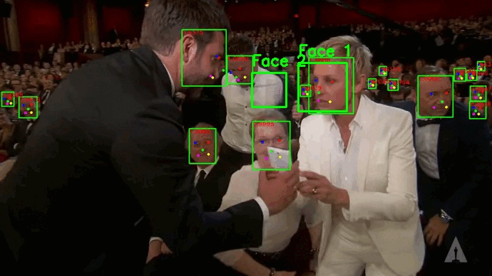

# 🎭🎵 FaceReco - Enhanced Emotion-Based Music Recommendation

A comprehensive face detection and emotion recognition system with **automatic Spotify music playback** based on detected emotions.



## 🌟 Enhanced Features

### 🎯 Core Capabilities
- **🚀 Real-time Face Detection**: Advanced YuNet neural network + Haar cascade fallback
- **🎭 Emotion Recognition**: AI-powered emotion detection using DeepFace
- **🎵 Smart Music Playback**: Automatic Spotify playlist selection based on emotions
- **📊 Analytics**: Emotion tracking and music recommendation logging
- **🍎 macOS Optimized**: Seamless camera integration for Apple devices

### 🎪 Emotion → Music Mapping
| Emotion | Playlist | Description |
|---------|----------|-------------|
| 😊 Happy | Happy Hits! 🎉 | Upbeat, energetic tracks |
| 😢 Sad | Chill & Relax 🌙 | Soothing, contemplative music |
| 😐 Neutral | Focus Flow 🎧 | Ambient, concentration music |
| 😠 Angry | Beast Mode ⚡ | High-energy, intense tracks |

## 🚀 Quick Start

### 1. Installation
```bash
# Clone the repository
git clone https://github.com/SatvikDB/FaceReco.git
cd FaceReco

# Run enhanced setup
python3 setup.py
```

### 2. Spotify Configuration
```bash
# Interactive Spotify setup
python3 spotify_config.py
```

### 3. Run Enhanced Demo
```bash
# Full emotion + music demo
python3 emotion_music_demo.py

# Enhanced static image demo
python3 demo_working.py
```

## 🎮 Demo Modes

### 🎥 Real-time Camera Demo
```bash
python3 emotion_music_demo.py
```
**Features:**
- Live face detection and emotion recognition
- Automatic music playback based on detected emotions
- Real-time overlay with user info and current playlist
- Interactive controls (pause, resume, save frames)

### 🖼️ Image Analysis Demo
```bash
python3 emotion_music_demo.py --image path/to/image.jpg
```
**Features:**
- Batch emotion analysis on static images
- Music recommendations for detected emotions
- Annotated result images

### 🧪 Basic Demos
```bash
# Basic face detection (no emotion/music)
python3 simple_face_detection.py

# Camera access testing
python3 camera_face_detection.py
```

## ⚙️ Configuration

### 🎵 Spotify Setup

#### Prerequisites
1. **Spotify Premium Account** (required for playback control)
2. **Spotify Developer App**:
   - Go to [Spotify Developer Dashboard](https://developer.spotify.com/dashboard)
   - Create new app: "FaceReco Emotion Music"
   - Add redirect URI: `http://localhost:8888/callback`
   - Note your `Client ID` and `Client Secret`

#### Configuration Methods

**Method 1: Interactive Setup**
```bash
python3 spotify_config.py
```

**Method 2: Environment Variables**
```bash
export SPOTIFY_CLIENT_ID="your_client_id_here"
export SPOTIFY_CLIENT_SECRET="your_client_secret_here"
export SPOTIFY_REDIRECT_URI="http://localhost:8888/callback"
```

**Method 3: Python Configuration**
```python
from spotify_credentials import *
# Auto-generated after running spotify_config.py
```

### 🎭 Emotion Detection Settings

The system uses **DeepFace** with multiple backend options:
- **Primary**: TensorFlow-based emotion recognition
- **Fallback**: OpenCV-based heuristic detection

```python
# Customize emotion detection
from emotion_detection import EmotionDetector

detector = EmotionDetector(
    backend='opencv',  # or 'ssd', 'dlib'
    model_name='emotion'
)
```

### 🎶 Custom Playlist Mapping

Update emotion-to-playlist mapping:
```python
from spotify_integration import get_spotify_controller

controller = get_spotify_controller()
controller.update_playlist_mapping(
    emotion="happy",
    playlist_url="https://open.spotify.com/playlist/YOUR_PLAYLIST_ID",
    playlist_name="My Happy Songs 🎉"
)
```

## 📁 Enhanced Project Structure

```
FaceReco/
├── 🎭 Emotion & Music Core
│   ├── emotion_detection.py          # AI emotion recognition
│   ├── spotify_integration.py        # Spotify API integration
│   ├── emotion_music_demo.py          # Main enhanced demo
│   └── spotify_config.py              # Interactive Spotify setup
│
├── 🎥 Face Detection Core
│   ├── camera_face_detection.py       # Real-time camera detection
│   ├── run_haar_fallback.py           # Haar cascade fallback
│   ├── simple_face_detection.py       # Basic image processing
│   └── demo_working.py                # Enhanced working demo
│
├── 🤖 YuNet Components
│   ├── YuNet.py                       # YuNet model implementation
│   ├── YuNetEdge.py                   # Edge processing
│   ├── YuNetRenderer.py               # Rendering utilities
│   └── demo.py                        # DepthAI hardware demo
│
├── ⚙️ Configuration & Setup
│   ├── setup.py                       # Enhanced installation script
│   ├── requirements.txt               # All dependencies
│   ├── spotify_credentials.py         # Generated Spotify config
│   └── spotify_config.json            # Playlist configuration
│
├── 📊 Data & Logs
│   ├── emotion_music_log.csv          # Emotion-music event log
│   ├── models/                        # Neural network models
│   └── img/                           # Sample images
│
└── 📚 Documentation
    ├── README.md                      # This file
    ├── CAMERA_SETUP.md                # Camera setup guide
    └── LICENSE.txt                    # License information
```

## 🎯 Usage Examples

### Real-time Emotion Music Demo
```bash
# Start camera demo
python3 emotion_music_demo.py

# Controls during demo:
# ESC/Q: Quit
# S: Save current frame
# P: Pause music
# R: Resume music
# SPACE: Reset emotion detection
```

### Batch Image Processing
```bash
# Process single image
python3 emotion_music_demo.py --image photo.jpg

# Process with custom settings
python3 -c "
from emotion_music_demo import EmotionMusicDemo
demo = EmotionMusicDemo()
demo.run_image_demo('path/to/image.jpg')
"
```

### Custom Integration
```python
from emotion_detection import detect_emotion_from_coordinates
from spotify_integration import play_music_for_emotion
import cv2

# Load image and detect faces
frame = cv2.imread('image.jpg')
faces = detect_faces(frame)  # Your face detection

for face_coords in faces:
    # Detect emotion
    emotion, confidence = detect_emotion_from_coordinates(frame, face_coords)
    
    # Play matching music
    if confidence > 0.7:
        success = play_music_for_emotion(emotion)
        print(f"Playing {emotion} music: {success}")
```

## 📊 Analytics & Logging

### Automatic Event Logging
The system automatically logs all emotion-music events:

```csv
Timestamp,User,Emotion,Confidence,Playlist,Status
2024-11-05 12:30:15,Satvik,happy,0.85,Happy Hits! 🎉,Success
2024-11-05 12:31:22,Satvik,neutral,0.72,Focus Flow 🎧,Success
```

### Session Statistics
- Total emotion detections
- Emotion frequency distribution
- Playlist play counts
- Session duration

## 🛠️ Development

### Adding New Emotions
```python
# 1. Update emotion mapping
emotion_mapping = {
    'surprised': 'happy',  # Map to existing category
    'excited': 'happy',    # Or create new playlist
}

# 2. Add playlist for new emotion
controller.update_playlist_mapping(
    emotion="excited",
    playlist_url="https://open.spotify.com/playlist/EXCITED_PLAYLIST",
    playlist_name="Excitement Zone ⚡"
)
```

### Custom Emotion Detection Models
```python
from emotion_detection import EmotionDetector

class CustomEmotionDetector(EmotionDetector):
    def detect_emotion(self, face_image):
        # Your custom emotion detection logic
        return emotion, confidence
```

### Extending Music Integration
```python
from spotify_integration import SpotifyController

class CustomMusicController(SpotifyController):
    def play_playlist_for_emotion(self, emotion):
        # Custom music selection logic
        # Could integrate with Apple Music, YouTube Music, etc.
        pass
```

## 🔧 Troubleshooting

### Common Issues

**Emotion Detection Not Working**
```bash
# Install/reinstall emotion dependencies
pip install deepface tensorflow tf-keras

# Test emotion detection
python3 -c "from emotion_detection import get_emotion_detector; print(get_emotion_detector().is_available)"
```

**Spotify Authentication Failed**
```bash
# Check credentials
python3 -c "import os; print('ID:', os.getenv('SPOTIFY_CLIENT_ID'))"

# Re-run configuration
python3 spotify_config.py

# Clear cache and retry
rm .spotify_cache
```

**Camera Access Denied (macOS)**
1. System Preferences → Security & Privacy → Camera
2. Enable camera access for Terminal/Python
3. Restart terminal after granting permissions

**No Active Spotify Device**
1. Open Spotify on any device (phone, computer, web player)
2. Start playing any song
3. Run the demo again

### Performance Optimization

**For Better Emotion Detection:**
- Ensure good lighting conditions
- Face should be clearly visible (not too small/large)
- Reduce camera resolution if processing is slow

**For Faster Processing:**
- Increase `emotion_cooldown` in demo settings
- Use smaller camera resolution
- Close other resource-intensive applications

## 🤝 Contributing

### Development Setup
```bash
# Clone and setup development environment
git clone https://github.com/SatvikDB/FaceReco.git
cd FaceReco

# Install in development mode
pip install -e .

# Install development dependencies
pip install pytest black flake8
```

### Adding Features
1. **Fork** the repository
2. **Create** feature branch (`git checkout -b feature/amazing-feature`)
3. **Implement** your changes with tests
4. **Commit** changes (`git commit -m 'Add amazing feature'`)
5. **Push** to branch (`git push origin feature/amazing-feature`)
6. **Open** Pull Request

## 📄 License

This project is licensed under the MIT License - see the [LICENSE.txt](LICENSE.txt) file for details.

## 🙏 Acknowledgments

- **OpenCV Zoo**: YuNet face detection model
- **DeepFace**: Emotion recognition framework
- **Spotify**: Music streaming API
- **PINTO**: Model optimization and conversion
- **Luxonis**: DepthAI hardware support

## 📞 Support

- 🐛 **Bug Reports**: [GitHub Issues](https://github.com/SatvikDB/FaceReco/issues)
- 💡 **Feature Requests**: [GitHub Discussions](https://github.com/SatvikDB/FaceReco/discussions)
- 📖 **Documentation**: [Wiki](https://github.com/SatvikDB/FaceReco/wiki)
- 💬 **Community**: [Discord Server](https://discord.gg/facereco)

---

**🎭🎵 Ready to detect emotions and play matching music? Start with `python3 emotion_music_demo.py`!**

*Transform your emotions into the perfect soundtrack with FaceReco!* 🎶✨